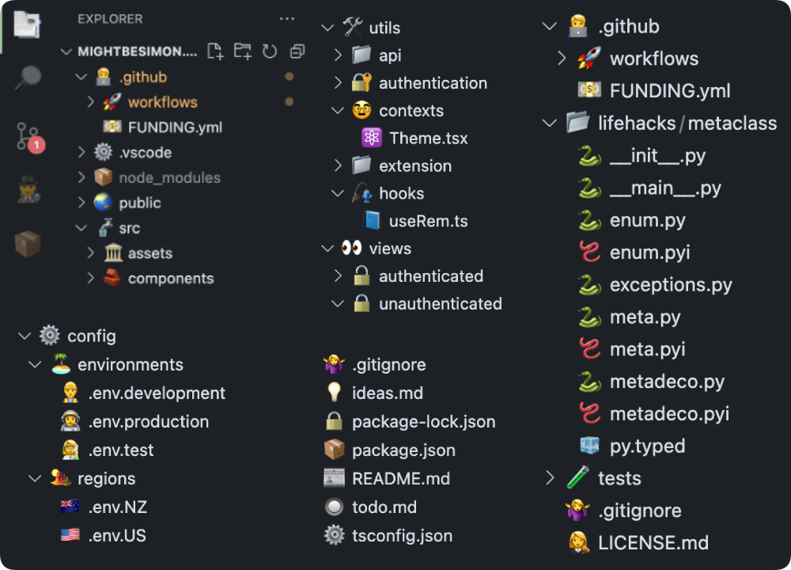
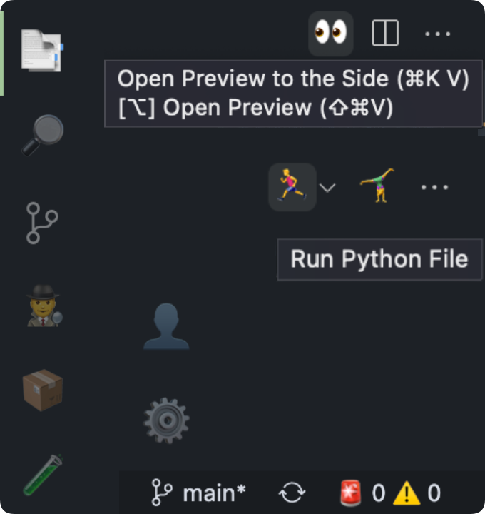

# Emoji File Icons 🤷‍♀️ 

> [Product Icons](#emoji-product-icons-pack) also here
>
> New emojis added frequently. Accepting emoji proposal PRs!

👉 Want to stand out from every other dev using material icons? 👈

I started making this extension ironically, ended up actually liking it too much..

# File Icons Pack

You can enable file icons independently of [product icons](#emoji-product-icons-pack)

## Emoji File Icons

See [emoji reference](#emoji-reference) below.

# Emoji Product Icons Pack

You can enable file icons independently of [file icons](#file-icons-pack)

## Emoji Product Icons (Fun)

Activity bar: [ 📑 🔎 🌿 🕵️‍♂️ 📦 🧪 ... 👤 ⚙️ ]

Status bar: [ 🌿 🔄/⤴️ 🚨 ⚠️ ... 🔔/📣 ]

## Emoji Product Icons (Professional)

minus goofy emojis, only serious emojis

Activity bar: [ 📑 🔎 ... 🕵️‍♂️ 📦 🧪 ... 👤 ⚙️ ]

Status bar: [ 🚨 ⚠️ ... 🔔/📣 ]

Other: [ 🗑 🐞 ⚙️ 🔒/🔓 💬 💡 ]

# Todo List

🚧 change skin tones or gender of emojis in settings

🚧 customise matches

🚧 change between Apple, and system emojis

✅ support more file types and folders

✅ automate publishing workflow

✅ automate update README.md

✅ automate generate file icon themes from reference file

✅ product icons (icons in the bar on your left) 📑🔎📦🧪👤⚙️

> more ideas welcome 🙂
>
> more file type requests welcome
>
> PRs welcome 👨‍🍳👌💋

# Contributors

- **Simon** - [mightbesimon](https://github.com/mightbesimon)
- [Jake Briscoe](https://github.com/jakebriscoe)
- [theowiik](https://github.com/theowiik)
- [String Max](https://github.com/String10)
- [Abiud Cantu](https://github.com/Abiud)
- 🤷‍♀️ - the gitignore lady
- 👉 you? 👈

# Emoji Reference

### Special Files

git and github

- 🤷‍♀️ .gitignore
- 💵 FUNDING.yml
- 🤖 dependabot.yml

docs

- 📰 README.md | README.txt | README.rst | README
- 🗓 CHANGELOG.md | CHANGELOG.txt | CHANGELOG
- 👩‍⚖️ LICENSE.md | LICENSE.txt | LICENSE.rst | LICENSE
- 🙋‍♀️ SUPPORT.md | SUPPORT.txt | SUPPORT
- 👮‍♂️ SECURITY.md | SECURITY.txt | SECURITY
- 🤥 CODE_OF_CONDUCT.md | CODE_OF_CONDUCT
- 😊 CONTRIBUTING.md | CONTRIBUTING
- 🤝 CONTRIBUTORS.md | CONTRIBUTORS
- ✍️ AUTHORS.md | AUTHORS
- 👍 ACKNOWLEDGMENTS.md | ACKNOWLEDGMENTS
- ❗️ ISSUE_TEMPLATE.md | ISSUE_TEMPLATE
- 💡 PULL_REQUEST_TEMPLATE.md | PULL_REQUEST_TEMPLATE
- 📖 CITATION.cff
- 💡 ideas.md | ideas.txt | ideas
- 🔘 todo.md | todo.txt | todo

vscode

- ⚙️ .vscode/settings.json
- 🚀 .vscode/launch.json
- ✅ .vscode/tasks.json
- 🛒 .vscode/extensions.json

node

- 📦 package.json
- 🔒 package-lock.json
- ⚙️ .npmrc
- 🤷‍♀️ .npmignore
- ⚙️ tsconfig.json
- 🃏 jest.config.ts | jest.config.js
- 🎭 playwright.config.ts | playwright.config.js

web

- 🌠 favicon.ico
- 🤖 robots.txt

application

- 🐳 DOCKERFILE
- 🔥 .firebaserc | firebase.json
- 🛒 requirements.txt | requirements
- 🧊 py.typed
- ⚙️ pyproject.toml
- ❄️ .flake8

config

- ⚙️ config.json
- 👩‍🔬 .env.test
- 👷‍♂️ .env.development
- 👨‍🚀 .env.production
- 🇳🇿 .env.NZ
- 🇦🇺 .env.AU
- 🇨🇳 .env.CN
- 🇺🇸 .env.US
- 🇨🇦 .env.CA
- 🇬🇧 .env.UK
- 🇩🇪 .env.DE
- 🇫🇷 .env.FR
- 🇮🇪 .env.IE

#

### File Extensions

- 📄 default files
- 📝 .txt
- 💾 .json
- 📗 .csv
- 📕 .pdf

programming

- 🐚 .sh | .bash
- 🦩 .swift
- 💎 .rb
- 🦀 .rs
- 🦫 .go

python

- 🐍 .py | .py3
- 🪱 .pyi
- 📓 .ipynb
- 🥚 .egg
- 🛞 .whl

Java

- ☕️ .java
- 🔠 .class
- 🍯 .jar

C

- 🏎 .c | .cpp
- 🤠 .h | .hpp
- #️⃣ .cs
- 👷‍♂️ .csproj

assembly

- 🔠 .asm
- ⏹ .obj | .o
- 🔣 .sym

typescript

- 💅 .styles.ts | .styles.js (styled-components)
- 🌲 .cy.ts | .cy.js (cypress)
- 🦮 .helpers.ts | .helpers.js

web

- 📘 .ts
- 📒 .js
- ⚛️ .tsx | .jsx (react)
- 💅 .css | .scss
- 🌏 .html
- 🛢 .db | .sql | .sqlite | .sqlite3 | .mysql
- 🍪 .cookie

development

- 📚 .md
- 🤐 .zip | .tar.gz
- 🚀 .yml | .yaml
- ⚙️ .env | .cfg | .config

R

- 📈 .r
- 📓 .rmd
- ⏳ .rhistory
- ⚙️ .rprofile
- 👷‍♂️ .rproj
- 💾 .rdata | .rds
- 📘 .qmd

misc

- ⚙️ .ini
- 💿 .iso
- 📋 .log
- 🗺 .map
- 🔒 .lock
- 📊 .stats
- 🔘 .todo

images

- 🏞 .png | .jpg | .jpeg
- 💃 .gif
- 📷 .heif
- 🎨 .svg

media

- 🎞 .mp4 | .mov
- 🔈 .mp3 | .wav

#

### Folders

- 📁/📂 default folder
- 🏠 home
- ⬇️ downloads
- 📑 documents
- 📗 lib | library
- 👤 user | users
- 🌠 images | pic | pictures
- 📚 doc | docs

- 🌿 .git
- 🧑‍💻 .github
- 🚀 .github/workflows
- 💡 PULL_REQUEST_TEMPLATE

- ⚙️ .vscode
- 📦 node_modules

- ⚙️ config | configuration | configurations
- ⚙️ setting | settings
- 🏝 env | environments
- 🏜 regions

- 🧪 test | tests
- 🔨 build
- 🌏 public
- 🏛 assets
- 🏛 res | resource | resources
- 🎞 media
- 🚰 src | source

- ⛺️ temp
- 🧱 components
- 🔠 types
- 🛠 util | utils | utility | utilities
- 👀 view | views
- 📺 screen | screens
- 🛬 landing
- 🤷‍♂️ 404 | notfound
- 🫖 418 | teapot

- 🔓 authenticated
- 🔒 unauthenticated
- 🔐 auth | authentication

- 🥸 context | contexts
- 🎣 hook | hooks
- 🗄 data

- 📊 figure | figures
- 📈 plot | plots

#

### activity bar

- 📑 files
- 🔎 search
- 🕵️‍♂️ debug-alt
- 📦 extensions
- 🧪 beaker
- 👤 account
- ⚙️ settings-gear

moveable items

- 🎃 symbol-class
- 🖇 references

extension items

- 🏷 bookmark
- 📡 remote-explorer

### status bar

- ☁️ cloud-upload
- ⚠️ warning
- 🚨 error

### identifiers

- 💡 lightbulb | light-bulb
- 🐞 bug | debug
- 📦 package
- 📌 pin
- 💬 comment | comment-add | comment-discussion
- 👀 open-preview
- 🏝 server-environment
- ❤️ heart
- ⭐️ star
- 🏠 home
- ⚙️ gear
- 🔒 lock
- 🔓 unlock
- 🔑 key
- 📓 notebook
- 🔌 plug
- 🔇 mute
- 🔈 unmute
- 💼 briefcase
- 🗓 calendar
- 📋 clippy
- ☁️ cloud
- 🧭 compass
- 💳 credit-card
- 🛢 database
- 📷 device-camera
- 🤐 file-zip
- 🔥 flame
- 🎁 gift
- 🌏 globe
- 📊 graph
- 📈 graph-line
- 📥 inbox
- ⚖️ law
- 📚 library
- 🔗 link
- 🧲 magnet
- ✉️ mail
- 📣 megaphone
- 🎓 mortar-board
- 📝 note
- 🧍🏻‍♀️ person | person-filled | person-follow | person-outline
- 🥧 pie-chart
- 📡 remote
- 🚀 rocket
- 💎 ruby
- 💾 save
- 🔎 search-save
- 🙂 smiley
- 🐿 squirrel
- 🎨 symbol-color
- 🧊 symbol-constant
- ⚡️ symbol-event
- 🔤 symbol-text
- 🏷 tag | tag-add | tag-remove
- 🎯 target
- 🔭 telescope
- 👎 thumbsdown
- 👍 thumbsup
- 🛠 tools
- ⏱ watch
- 🔧 wrench | wrench-subaction
- ⚡️ zap | github-action

#

### activity bar

- 🌿 source-control

### status bar

- 🌿 git-branch
- 🔄 sync
- ℹ️ info
- 🔔 bell
- 🛎 bell-dot

### identifiers

- 🏃‍♂️ play
- ⚖️ compare-changes
- 🤸‍♀️ split-horizontal
- 🗑 trash | trashcan
- 🧽 clear-all
- 🚰 filter
- 🍺 refresh
- 🛑 debug-stop
- 🎬 debug-restart
- 🤫 mute
- 👂 unmute
- 🅱️ bold
- 📖 book
- 🎥 device-camera-video
- 🖥 device-desktop
- 📱 device-mobile
- ✏️ edit | pencil
- 👕 jersey
- 🥞 layers
- 📍 location
- 💅 paintcan
- 📰 preview
- 👀 eye | eye-unwatch | eye-watch
- 📡 radio-tower
- 🎛 settings | dashboard
- 🛡 shield
- 🐧 terminal-linux
- 🖥 vm
- 🪟 window

#
