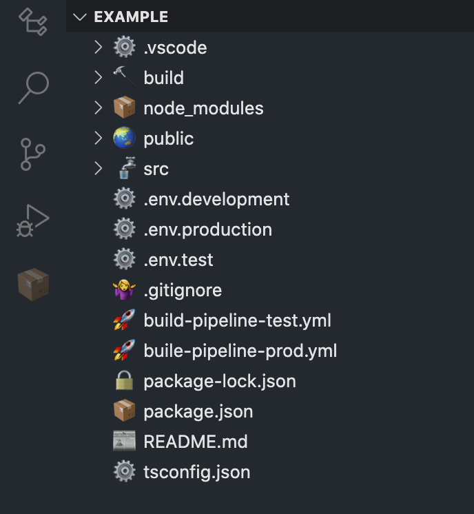
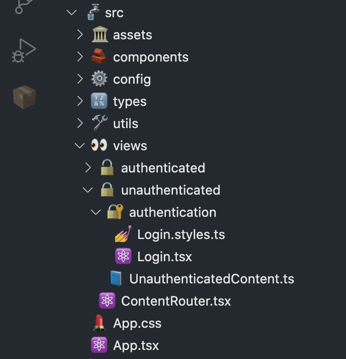
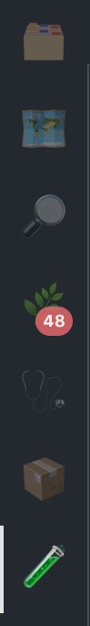
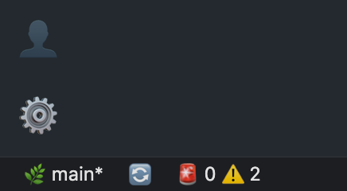
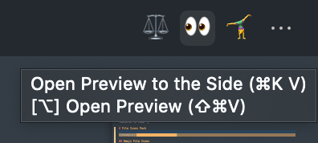
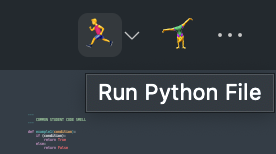
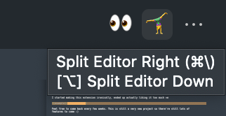

# Emoji File Icons 🤷‍♀️

  

> [Product Icons](#emoji-product-icons-pack) also here

Want to stand out from every other dev using material icons?

Goof around a bit today!

I started making this extension ironically, ended up actually liking it too much 😅

Feel free to come back every few weeks. This is still a very new project so there're still lots of features to come :)

# File Icons Pack

You can enable file icons independently of [product icons](#emoji-product-icons-pack)

<table>
	<tr>
		<td>
			
		</td>
		<td>
			
		</td>
	</tr>
</table>

## Emoji File Icons

See [emoji reference](#emoji-reference) below.

# Emoji Product Icons Pack

You can enable file icons independently of [file icons](#file-icons-pack)

<table>
	<tr>
		<td>
			
		</td>
		<td>
			
			
		</td>
	</tr>
</table>
<table>
	<tr>
		<td>
			
			
		</td>
		<td>
			
			
		</td>
		<td>
		</td>
	</tr>
</table>

## Emoji Product Icons (Fun)

Activity bar: [ 📑 🗺 🔎 🌿 🕵️‍♂️ 📦 🧪 ... 👤 ⚙️ ]

Status bar: [ 🌿 🔄/⤴️ 🚨 ⚠️ ... 🔔/📣 ]

## Emoji Product Icons (Professional)

minus goofy emojis, only serious emojis

Activity bar: [ ... 🕵️‍♂️ 📦 🧪 ... 👤 ⚙️ ]

Status bar: [ 🚨 ⚠️ ... 🔔/📣 ]

Other: [ 🗑 🐞 ⚙️ 🔒/🔓 💬 💡 ]

# Todo List

🚧 change skin tones or gender of emojis in settings

🚧 customise matches

🚧 change between Apple, and system emojis

✅ support more file types and folders

✅ automate publishing workflow

✅ automate update README.md

✅ automate generate file icon themes from reference file

✅ product icons (icons in the bar on your left) 🗂🔎👤⚙️

> more ideas welcome 🙂
>
> more file type requests welcome
>
> PRs welcome 👨‍🍳👌💋

# Contributors

- **Simon** - [mightbesimon](https://github.com/mightbesimon)
- **Jake** - [JakeBriscoe](https://github.com/jakebriscoe)
- 🤷‍♀️ - the gitignore lady
- you?

# Emoji Reference

### Special Files

git and github

- 🤷‍♀️ .gitignore
- 💵 FUNDING.yml
- 🤖 dependabot.yml

docs

- 📰 README.md | README.txt | README
- 🗓 CHANGELOG.md | CHANGELOG.txt | CHANGELOG
- 👩‍⚖️ LICENSE.md | LICENSE.txt | LICENSE
- 🙋‍♀️ SUPPORT.md | SUPPORT.txt | SUPPORT
- 👮‍♂️ SECURITY.md | SECURITY.txt | SECURITY
- 🤥 CODE_OF_CONDUCT.md | CODE_OF_CONDUCT.txt | CODE_OF_CONDUCT
- 😊 CONTRIBUTING.md | CONTRIBUTING.txt | CONTRIBUTING
- 🤝 CONTRIBUTORS.md | CONTRIBUTORS.txt | CONTRIBUTORS
- ✍️ AUTHORS.md | AUTHORS.txt | AUTHORS
- 👍 ACKNOWLEDGMENTS.md | ACKNOWLEDGMENTS.txt | ACKNOWLEDGMENTS
- ❗️ ISSUE_TEMPLATE.md | ISSUE_TEMPLATE.txt | ISSUE_TEMPLATE
- 💡 PULL_REQUEST_TEMPLATE.md | PULL_REQUEST_TEMPLATE.txt | PULL_REQUEST_TEMPLATE
- 📖 CITATION.cff
- 💡 ideas.md | ideas.txt | ideas
- 🔘 todo.md | todo.txt | todo

vscode

- ⚙️ .vscode/settings.json
- 🚀 .vscode/launch.json
- ✅ .vscode/tasks.json
- 🛒 .vscode/extensions.json

node

- 📦 package.json
- 🔒 package-lock.json
- ⚙️ .npmrc
- 🤷‍♀️ .npmignore
- ⚙️ tsconfig.json
- 🃏 jest.config.ts | jest.config.js
- 🎭 playwright.config.ts | playwright.config.js

web

- 🌠 favicon.ico
- 🤖 robots.txt

application

- 🐳 DOCKERFILE
- 🔥 .firebaserc | firebase.json
- 🛒 requirement.txt | requirement
- ⚙️ pyproject.toml
- ❄️ .flake8

config

- ⚙️ config.json
- 👩‍🔬 .env.test
- 👷‍♂️ .env.development
- 👨‍🚀 .env.production
- 🇳🇿 .env.NZ
- 🇦🇺 .env.AU
- 🇨🇳 .env.CN
- 🇺🇸 .env.US
- 🇨🇦 .env.CA
- 🇬🇧 .env.UK
- 🇩🇪 .env.DE
- 🇫🇷 .env.FR
- 🇮🇪 .env.IE

#

### File Extensions

- 📄 default files
- 📝 .txt

programming

- 🐚 .sh | .bash
- 🦩 .swift
- 💎 .rb
- 🦀 .rs

python

- 🐍 .py | .py3
- 📓 .ipynb
- 🥚 .egg
- 🛞 .whl

Java

- ☕️ .java
- 🔠 .class
- 🍯 .jar

C

- 🏎 .c | .cpp
- 🤠 .h | .hpp
- #️⃣ .cs
- 👷‍♂️ .csproj

web

- 📘 .ts
- 📒 .js
- ⚛️ .tsx | .jsx (react)
- 💅 .css | .scss
- 🌏 .html
- 🛢 .db | .sql | .sqlite | .sqlite3 | .mysql
- 🍪 .cookie
- 🗃 .json

- 💅 .styles.ts | .styles.js (styled-components)
- 🌲 .cy.ts | .cy.js (cypress)
- 🦮 .helpers.ts | .helpers.js ()

development

- 📚 .md
- 🤐 .zip | .tar.gz
- 🚀 .yml | .yaml
- ⚙️ .env | .cfg | .config

misc

- ⚙️ .ini
- 💿 .iso
- 📋 .log
- 🗺 .map
- 🔒 .lock
- 📊 .stats
- 🔘 .todo

images

- 🏞 .png | .jpg | .jpeg
- 💃 .gif
- 📷 .heif
- 🎨 .svg

media

- 🎞 .mp4 | .mov
- 🔈 .mp3 | .wav

#

### Folders

- 📁/📂 default folder
- ⬇️ downloads
- 📑 documents
- 📗 lib | library
- 👤 user | users
- 🌠 images | pic | pictures
- 📚 doc | docs

- 🌿 .git
- 🧑‍💻 .github
- 🚀 .github/workflows
- 💡 PULL_REQUEST_TEMPLATE

- ⚙️ .vscode
- 📦 node_modules

- ⚙️ config | configuration | configurations
- ⚙️ setting | settings
- 🏝 env | environments
- 🏜 regions

- 🧪 test | tests
- 🔨 build
- 🌏 public
- 🚰 src

- ⛺️ temp
- 🏠 home
- 🏛 assets
- 🧱 components
- 🔠 types
- 🛠 util | utils | utility | utilities
- 👀 view | views
- 📺 screen | screens
- 🛬 landing
- 🤷‍♂️ 404 | notfound
- 🫖 418 | teapot

- 🔓 authenticated
- 🔒 unauthenticated
- 🔐 auth | authentication

- 🥸 context | contexts
- 🎣 hook | hooks
- 🗄 data

#

### activity bar

- 📑 files
- 🔎 search
- 🕵️‍♂️ debug-alt
- 📦 extensions
- 🧪 beaker
- 👤 account
- ⚙️ settings-gear

moveable items

- 🗺 symbol-class
- 🖇 references

extension items

- 🏷 bookmark

### status bar

- ☁️ cloud-upload
- ⚠️ warning
- 🚨 error
- 🔔 bell
- 📣 bell-dot

### identifiers

- 👀 open-preview
- 🐞 bug / debug
- ⚙️ gear
- 🔒 lock
- 🔓 unlock
- 📖 book
- 💬 comment / comment-discussion
- ⭐️ star
- 💡 lightbulb

#

### activity bar

- 🌿 source-control

### status bar

- 🌿 git-branch
- 🔄 sync
- ℹ️ info

### identifiers

- 🏃‍♂️ play
- ⚖️ compare-changes
- 🤸‍♀️ split-horizontal
- 🗑 trash / trashcan
- 🧽 clear-all
- 🚰 filter
- 🍺 refresh
- 🛑 debug-stop
- 🎬 debug-restart

#
